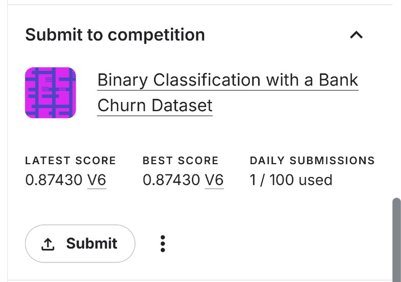

<p align="center">
  <strong style="font-size: 40px;">🏦 Bank Churn Prediction</strong><br>
  <em>Binary Classification with a Bank Churn Dataset</em><br><br>
  <a href="https://github.com/Toshaksha/kaggle-competitions">
    
  </a>
  
</p>

---

## 📑 Table of Contents

- [Competition Overview](#-competition-overview)
- [Dataset](#-dataset)
- [Files Included](#-files-included)
- [Results](#-results)
- [Approach Summary](#-approach-summary)
- [How to Use](#-how-to-use)
- [Contact](#-contact)

---

## 📌 Competition Overview

In the highly competitive financial industry, predicting customer churn is crucial.  
This binary classification task uses customer data (age, balance, geography, etc.) to predict whether a customer will **exit (churn)** (`1`) or **stay** (`0`).

**Evaluation Metric:** Area Under the ROC Curve (ROC AUC)  
**Final Score Achieved:** `0.8743`

---

## 📊 Dataset

- **Train dataset:** Customer features + labels indicating if the customer exited  
- **Test dataset:** Customer features without labels (for prediction)  
- **Sample Submission:** Template for submission format  

---

## 📁 Files Included

| File                        | Description                                                                    |
| --------------------------- | ------------------------------------------------------------------------------ |
| `bank_churn_notebook.ipynb` | Main Jupyter Notebook with full EDA, preprocessing, training & submission code |
| `submission.csv`            | Submission file generated by the model (ready for Kaggle upload)               |
| `kaggle_score.png`          | Screenshot showing submission details (latest score, best score, submissions)  |

---

## 🏆 Results

**Final ROC AUC Score:** 0.8743

<p align="center">
  
</p>

---

## 🔍 Approach Summary

1. **Data Exploration & Cleaning**  
   - Checked for class imbalance  
   - Dropped irrelevant features (`id`, `CustomerId`, `Surname`)

2. **Feature Engineering**  
   - Label encoded categorical variables (`Geography`, `Gender`)  
   - Standardized numerical features

3. **Modeling**  
   - Used **Logistic Regression** with `class_weight='balanced'`  
   - Tuned hyperparameters for optimal ROC AUC on validation set

4. **Prediction**  
   - Generated predictions on test data  
   - Created a properly formatted `submission.csv` file

---

## 🚀 How to Use

To reproduce the solution:

```bash
# Clone the repo
git clone https://github.com/Toshaksha/kaggle-competitions.git

# Ensure required dependencies are installed:
pip install pandas scikit-learn matplotlib seaborn

# Open the notebook in Jupyter or VSCode
```

---

## 📬 Contact
Feel free to reach out if you have any questions or suggestions!

---

### Happy Kaggle-ing! 🚀

---
